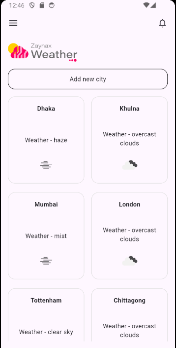

# Zaynax Limited Weather App

This is a demo project for Zaynax Limited. The app showcases a weather application with a home screen displaying weather information for five pre-added cities. Users can add, update, or delete cities. Additionally, users can change the language in the app's drawer, which will affect the drawer and the logo on the home screen. The app also features a pull-to-refresh functionality to update the weather data.

## Features

- **Home Screen**: Displays weather information for five pre-added cities.
- **Add Cities**: Users can add new cities.
- **Update/Delete Cities**: Users can long-press on the cards to update existing cities, or delete cities.
- **Language Change**: Users can change the app's language using a switch in the drawer. Currently, this change affects the drawer and the home screen logo.
- **Pull to Refresh**: Users can update the weather data by pulling down on the home screen.

## Screenshots

### 1. Home Screen



### 2. Pull to Refresh


### 3. Drawer


### 4. Change Language


### 5. Update and Delete Modal Bottom Sheet


### 6. Updating


### 7. Deleting


## Installation

1. Clone the repository:
   ```bash
   git clone https://github.com/yourusername/zaynax_weather_app.git
   cd zaynax_weather_app
   ```
